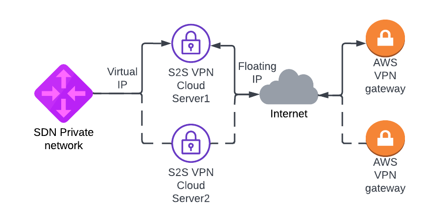

# Terraform UpCloud - AWS Site-to-Site VPN demo 

Please note that this is just an example on how you can use Terraform with [UpCloud](https://upcloud.com/) and should 
not be used in production as is. Please see [LICENSE](LICENSE) for details.



## Usage

Demo uses [StrongSwan](https://www.strongswan.org/) to create IPSEC Site-to-Site VPN on top of UpCloud. In this demo we 
create two different S2S VPN UpCloud cloud servers to create S2S VPN tunnel to Amazon Web Services VPN gateway. 
Keepalived (VRRP) is used to create virtual IP that moves automatically to different VPN cloud servers, when ipsec tunnel goes down. 
Servers on UpCloud side need static route to remote network via this virtual IP. VPN tunnel is created to flaoting IP 
that can be moved between VPN cloud servers with `attach-floating-ip-sh`. Please note that with this example failover 
does not happen automatically and it requires moving floating IP to second VPN Cloud server.

### Prerequisites

Project uses [Terraform](https://www.terraform.io/) and it needs to be installed. We're also using AWS and UpCloud 
Terraform providers, but these should be automatically installed by running `terraform init` or with `make init`.

To create the resources with Terraform, you'll need your API credentials exported.

For UpCloud
```
export UPCLOUD_USERNAME=your_username
export UPCLOUD_PASSWORD=your_password
```
For AWS
```
export AWS_ACCESS_KEY_ID="<Your Access Key ID>"
export AWS_SECRET_ACCESS_KEY="<Your access Key>"
export AWS_DEFAULT_REGION="<Your region>"
```
You must also create `config.tfvars` file with your own settings:
 
```

aws_network = "10.0.0.0/24" # Subnetwork to be created in AWS
upcloud_network = "10.255.0.0/24" # Subnetwork for UpCloud side SDN private network 
virtual_ip = "10.255.0.254" # IP address (other than first IP) from upcloud_network to be used for VIP between VPN cloud servers. 
zone = "pl-waw1"
server_plan = "1xCPU-1GB"
ssh_key_public = "ssh-rsa AAAA_YOUR_SSH_PUBLIC_KEY"
```
You should change the VRRP password (auth_pass) in `configs/keepalived.conf.tftpl` 

### Quickstart

**IMPORTANT: Make sure your SSH-agent is running (execute this if not: `eval$(ssh-agent) && ssh-add <path_to_private_key> && ssh-add -L`), 
so Terraform scripts can SSH into VMs using agent forwarding**


### Creating services with basic configuration

Initiate the project and install providers.

```
make init
```

Demo can now be created with Terraform. Creation takes around 10-15 minutes.

```
make create
```

### Testing stuff

You should log in to VPN server and check if Site-to-Site VPN is up. 

```
bash# ipsec status
Security Associations (1 up, 0 connecting):
upcloud-to-remote-tunnel[1]: ESTABLISHED 12 seconds ago, 5.22.222.156[5.22.222.156]...16.170.124.223[16.170.124.223]
upcloud-to-remote-tunnel{1}:  INSTALLED, TUNNEL, reqid 1, ESP in UDP SPIs: c5be2b11_i ccb656b4_o
upcloud-to-remote-tunnel{1}:   10.255.0.0/24 === 10.200.0.0/24

bash# systemctl status keepalived
● keepalived.service - Keepalive Daemon (LVS and VRRP)
     Loaded: loaded (/lib/systemd/system/keepalived.service; enabled; vendor preset: enabled)
     Active: active (running) since Wed 2022-06-01 06:27:10 UTC; 1min 50s ago
   Main PID: 3170 (keepalived)
      Tasks: 2 (limit: 1012)
     Memory: 2.4M
     CGroup: /system.slice/keepalived.service
             ├─3170 /usr/sbin/keepalived --dont-fork
             └─3171 /usr/sbin/keepalived --dont-fork

Jun 01 06:27:10 s2s-vpn-vm1-pl-waw1 Keepalived_vrrp[3171]: (VI_1) Entering BACKUP STATE (init)
Jun 01 06:27:10 s2s-vpn-vm1-pl-waw1 Keepalived_vrrp[3171]: Script `ipsec_status` now returning 1
Jun 01 06:27:10 s2s-vpn-vm1-pl-waw1 Keepalived_vrrp[3171]: VRRP_Script(ipsec_status) failed (exited with status 1)
Jun 01 06:28:33 s2s-vpn-vm1-pl-waw1 Keepalived_vrrp[3171]: Script `ipsec_status` now returning 0
Jun 01 06:28:34 s2s-vpn-vm1-pl-waw1 Keepalived_vrrp[3171]: VRRP_Script(ipsec_status) succeeded
Jun 01 06:28:34 s2s-vpn-vm1-pl-waw1 Keepalived_vrrp[3171]: (VI_1) Changing effective priority from 101 to 111
Jun 01 06:28:35 s2s-vpn-vm1-pl-waw1 Keepalived_vrrp[3171]: (VI_1) received lower priority (101) advert from 10.255.0.2 - discarding
Jun 01 06:28:36 s2s-vpn-vm1-pl-waw1 Keepalived_vrrp[3171]: (VI_1) received lower priority (101) advert from 10.255.0.2 - discarding
Jun 01 06:28:37 s2s-vpn-vm1-pl-waw1 Keepalived_vrrp[3171]: (VI_1) received lower priority (101) advert from 10.255.0.2 - discarding
Jun 01 06:28:37 s2s-vpn-vm1-pl-waw1 Keepalived_vrrp[3171]: (VI_1) Entering MASTER STATE
```
You can use `attach-floating-ip.sh` bash script to move floating ip between two S2S cloud servers. 
You can test failover by shutting down active VPN VM and then moving floating IP to standby VPN cloud server with this script.

### Destroying stuff

After testing things around its good to free the resources. Tearing the thing down is also just one command.

```
make destroy
```
